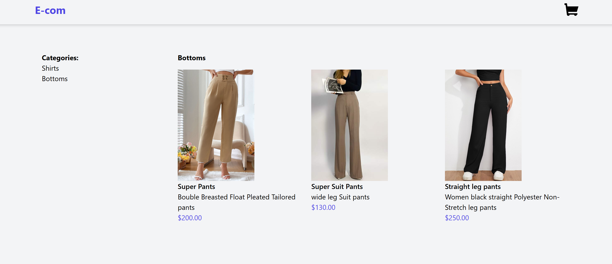
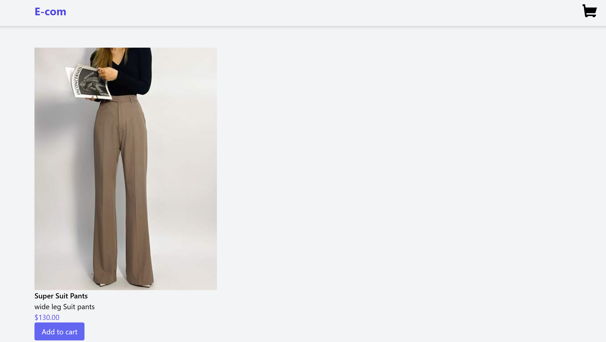
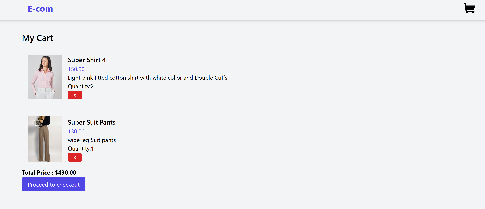
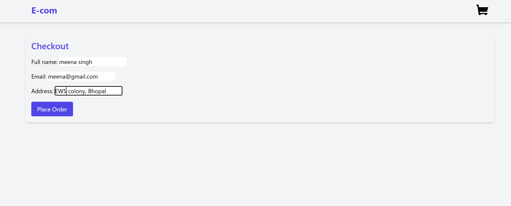
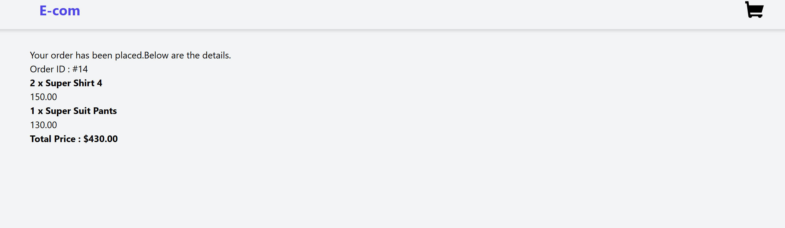

# 🛍️ Django E-Commerce Website

A fully functional e-commerce web application built using **Django**, supporting features like product listings, user registration/login, shopping cart, order placement, and admin controls.

---

## ✅ Core Features

- User registration and login
- Product listing with categories
- Product detail page
- Add to cart / Remove from cart
- Cart total and quantity update
- Checkout process with address and payment (dummy/pay integration)
- Order history for users
- Django admin for product/order management

---

## 🧰 Tech Stack

- **Backend**: Django 4.x+
- **Frontend**: HTML, CSS, JavaScript ,Bootstrap,Tailwind 
- **Database**: SQLite3 
- **Auth**: Django built-in auth
- **Payments**: (Optional) Stripe, Razorpay

---
📁 Project Structure
```
ecom/
├── ecomsite/              # Main application
├── templates/         # HTML templates
├── static/            # Static files (CSS, JS, Images)
├── media/             # Uploaded media files
├── manage.py
├── db.sqlite3
└── requirements.txt
```

## Screenshots

<p align="center">
  
</p>

<p align="center">
  
</p>

<p align="center">
  
</p>

<p align="center">
  
</p>

<p align="center">
  
</p>

## 📦 Installation & Setup
1. Clone the Repository

```bash
git clone https://github.com/rashi311/Ecommerce-site-using-Django.git
cd django-ecommerce-site
```

2. Set Up Virtual Environment
```
python -m venv env
# Windows
env\Scripts\activate
# Linux/macOS
source env/bin/activate
```

3. Install Requirements
```
pip install -r requirements.txt
```

4. Apply Migrations
```
python manage.py makemigrations
python manage.py migrate
```

5. Create Superuser
```
python manage.py createsuperuser
```

6. Run the Server
```
python manage.py runserver
```
Go to: http://127.0.0.1:8000


🧪 Testing Functionality
- Create categories and products from admin panel: /admin/

- Add to cart from product listing

- Checkout (address form)

- View order summary after placing the order


⚙️ Customization
- 🔒 Add payment gateway (Stripe/Razorpay)

- 🖼️ Enable image uploads via media/

- 🧾 Add invoice generation

- 📈 Add filters/search functionality


🔒 Admin Panel
Go to http://127.0.0.1:8000/admin/ and log in with your superuser credentials to:

- Manage products

- Manage users

- View orders
